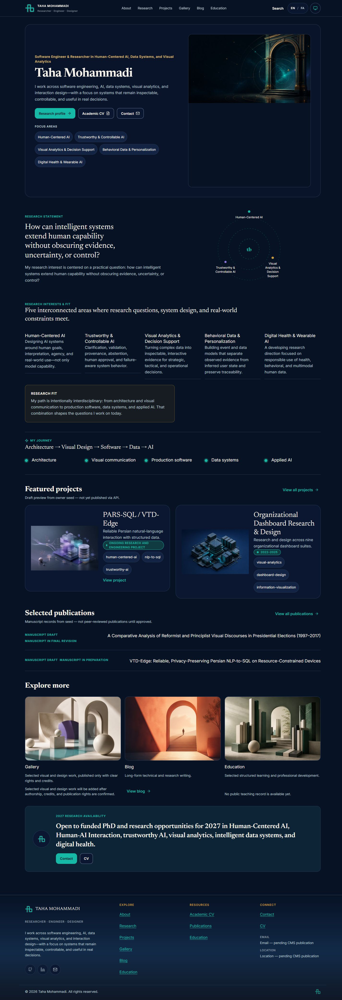
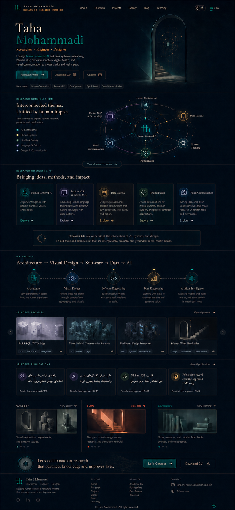
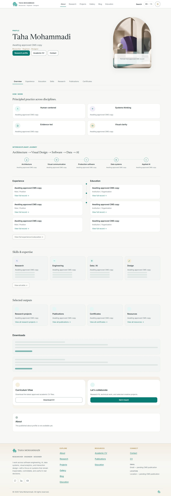
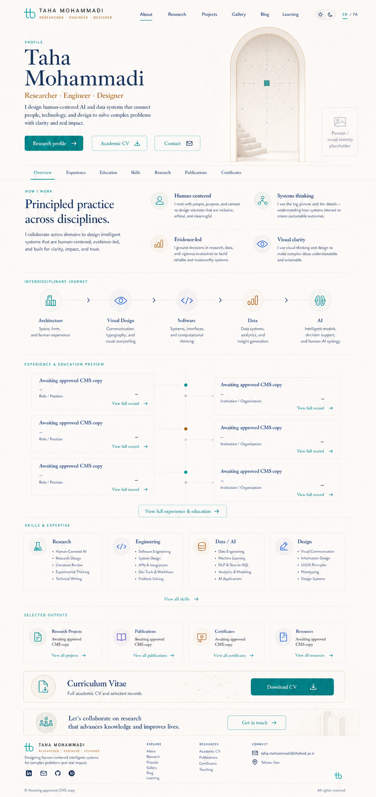

# Evidence and fidelity findings — 2026-09-05

## Evidence limits

Live in-app browser inspection covered the language gateway, FA/EN Home, EN About and EN Research. EN Home was captured in Light and Dark at a requested 1440×1000 viewport; FA Home in Dark at that desktop viewport plus the original narrow browser surface. Full-page image dimensions differ from CSS viewport because they include document height and exclude the scrollbar; exact image sizes/hashes are in [capture-manifest.json](capture-manifest.json). The original gateway capture was **364 image pixels wide**, not a verified 390px acceptance run. No six-width site test, real zoom test, accessibility audit, WebGL benchmark or deployment verification was run here.

The first browser navigation timed out but the page subsequently loaded and was inspected successfully. Web extraction did not retrieve staging; all live visual claims here come from the browser, not that failed extraction. Screenshot capture dates describe this run, not the source revision's release date. Staging's deployed Git SHA was not independently established; local source findings are explicitly separate.

The owner's seven `Front-End/Assets/وضعیت موجود/FireShot*.png` screenshots were visually inspected together with all eight page-family concept thumbnails. They are owner-supplied comparison evidence, not newly captured staging state or release evidence. The saved [contact sheet](../../10-tracking/concept-alignment-2026-09-05/reference-contact-sheet.jpg) is a thumbnail inspection aid; read the originals for exact text.

## Capture sequence and findings

1. **Gateway `/`:** a centered identity/language layout with a visible rectangular portal image and separate orbital decoration. V2 replaces the decorative render with authored geometry while retaining immediate native language links.
2. **Home `/fa/`, `/en/`:** the large bordered hero card and tall art well weaken the unboxed, editorial composition. The horizontal art occupies the upper part of the well, leaving substantial empty space below it. Source confirms a 4:5 media container with multiple nested picture wrappers; the exact CSS sizing cause needs CA-03 investigation, not a guessed one-line fix.
3. **Home graph:** currently separate from the hero, visually sparse and text-heavy. Local `HomeResearchGraph.astro` derives `diagramNodes = content.nodes.slice(0, 3)` and hard-codes `unavailable-route`. These implementation choices are replaced by the integrated, data-aware design. They do not prove what the published graph endpoint currently returns.
4. **Home hierarchy:** long role/statement/collaboration text consumes display space. Reassign heading/body roles and restore name emphasis, preserving approved copy. Do not invent shorter personal claims.
5. **About `/en/about/`:** a gallery illustration appears inside an arch-shaped portrait-like slot alongside a portrait placeholder; published copy is unavailable in visible areas. V2 removes that misleading media role and designs genuine unavailable/ready variants separately.
6. **Research `/en/research/`:** the first screen combines a prominent coral architectural image with another atmospheric background and a large card. This differs from the restrained title/constellation hierarchy in the PF-05 reference. V2 uses a content-led Research lead and the shared graph rather than reusing the gateway portal.
7. **Owner-supplied page-family screenshots:** gallery repeats a small decorative media set; project and teaching layouts have noticeably different density and media treatment from concepts. These are limited thumbnail-level observations from supplied images. CA-12–CA-15 must capture current matching routes/data before implementing details.

## Comparison images

The two Home images below are **same theme, different source scale and composition**, for visual diagnosis only. No pixel-diff or fidelity percentage is claimed. The final V2 target intentionally moves the graph into the hero and removes the Home portal under the latest owner instruction.

| Live EN Home, Dark | Historical Home concept, Dark |
|---|---|
|  |  |

| Live About, Light | About reference, Light |
|---|---|
|  |  |

## Source and contract evidence

Local baseline before writes: root `c69e339c8c26788467d29ad346fb7df99b1c2842`; PUBLIC `b895b2cb9c6ad9519d55bd2663448461931c0a39`. Root, PUBLIC, ADMIN and BACKEND reported clean status before changes. These are local baseline commits, not asserted staging deploy commits.

| Source inspected | Evidence | Planning implication |
|---|---|---|
| PUBLIC `package.json` | Astro `^7.2.9`, GSAP `^3.15.0`, no Three.js dependency | Reuse installed stack; CA-04 alone owns adding a pinned Three.js dependency and lockfile. |
| `src/pages/{fa,en}/index.astro` | Separate identity-lead and relationship-graph slot assignments | CA-03 moves graph into identity-lead in both routes. |
| `src/components/home/HomeHero.astro` | Role precedes name; separate ThemePicture media panel | Reconstruct composition; preserve source facts and existing CTA destinations. |
| `src/lib/home-content.ts` | Explicit draft seed provenance and separate namePrimary/nameAccent; locale-specific graph labels | Preserve provenance; do not relabel seed as published API. |
| `src/generated/public-api.ts` | `/api/graph/{locale}`; nodes/edges, optional z; relatedRecords has family/id but no href/slug | Existing graph adapter can be built without a new backend schema; resolve links against published family records. |
| `docs/architecture/ADR-ANIMATION.md`, central ADR-0007 | Older restrictions contradict new explicit GSAP/Three.js direction | New ADR-0008 supersedes narrow rules; original ADR records remain intact. |
| `agent-kit/README.md` in reference | Contains historical paths and legacy instructions | Reference evidence only. V2 packets point to actual current code and contracts. |
| `Docs/02-architecture/ROUTE-REGISTRY.md` | Canonical Blog/Education/Gallery; legacy redirects | Do not follow stale route names from old task prose or raster text. |

## Owner incoming package reconciliation

Compared 74 files under the five specifically named incoming trees (`agent-kit`, `art`, `brand`, `concepts`, `provenance`) with same relative paths in tracked authority: **31 identical, 9 different, 34 local-only**. The 9 differences are agent-kit files and `brand/SOURCE-NOTE.md`; the source manifest records exact hashes and roles. Same-path local-only provenance files are not missing runtime assets. No incoming code or instruction was executed, promoted, deleted or copied into runtime. The separate local `figma sample` code trees were not implementation inputs.

Details: [source-reconciliation.json](source-reconciliation.json). Concept and artwork hashes were reconciled before treating them as the same visual input. A complete hash list is preferable to assuming that same-named files are interchangeable.

## Validation performed on this documentation delivery

- Central tracked-reference validator: PASS — 24 components, 6 templates, 10 asset references, 26 required files, 32 binary checksums, 3 aliases, offline Figma builder.
- PUBLIC `npm.cmd run validate:design`: PASS — local and central pinned snapshots agree. Runtime/design snapshots remain untouched.
- One initial central-validator invocation used PUBLIC as cwd and failed to locate the root-relative script; it was rerun successfully using its full absolute path. It was a command-path error, not an integrity failure.
- Packet dependency, Markdown links, source/capture hashes, allowlist overlap and final Git scope are checked in [DELIVERY-CHECK.md](DELIVERY-CHECK.md).

No product runtime changes, new dependency installation, full product test run, commit, push or deployment occurred in this planning delivery. Existing acceptance gates stay open.
